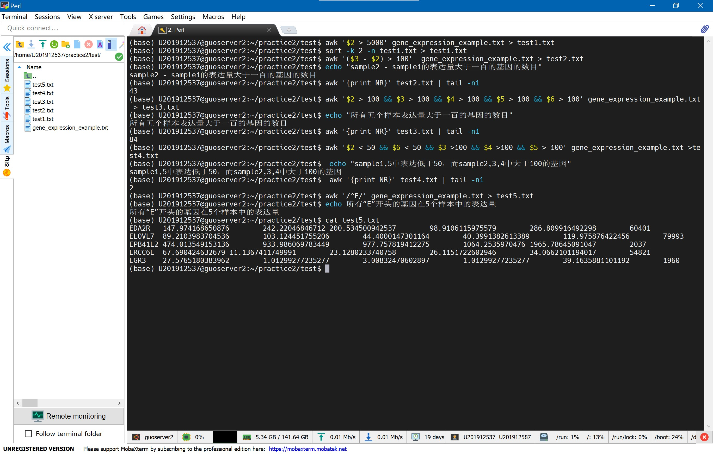

## <center>perl上机报告</center>
###### <p align=Right> --登峰1901 张皓鸿 </p>
### <center>上机一</center>
#### 选取在sample1中表达量大于5000的基因symbol，gene id，并按gene id大小排序
```
awk '$2 > 5000' gene_expression_example.txt > f1
sort -k 2 -n f1 > f1_sorted
```
#### 选取samlple2-sample1差异大于100的基因，并统计数目
```
awk '($3 - $2) > 100'  gene_expression_example.txt > f2
echo "sample2 - sample1的表达量大于一百的基因的数目"
awk '{print NR}' f2 | tail -n1
```

#### 选取所有5个样本（sample1-5）中表达量都大于100的基因，统计数目
```
awk '$2 > 100 && $3 > 100 && $4 > 100 && $5 > 100 && $6 > 100' gene_expression_example.txt > f3
echo "所有五个样本表达量大于一百的基因的数目"
awk '{print NR}' f3 | tail -n1
```

#### 选取sample1,5中表达低于50，而sample2,3,4中大于100的基因，列出gene symbol并统计数目
```
 awk '$2 < 50 && $6 < 50 && $3 >100 && $4 >100 && $5 > 100' gene_expression_example.txt >f4
 echo "sample1,5中表达低于50，而sample2,3,4中大于100的基因"
 awk '{print NR}' f4 | tail -n1
 ```

#### 获得所有“E”开头的基因在5个样本中的表达量\
```
awk '/^E/' gene_expression_example.txt > f5
echo 所有“E”开头的基因在5个样本中的表达量
cat f5
```
运行结果如下

### <center>上机二</center>
#### 练习一
代码
```
import pandas as pd
from math import*


if __name__ == '__main__':


    r = float(input('请输入半径'))
    if(r > 0):
        print(f'周长为{2*pi*r}')
    else:
        print('周长为0')

    num_1, num_2 = float(input('请输入数字1')), float(input('请输入数字2'))
    print(f'两数之积为{num_1*num_2}')

    output_sting = input('请输入字符串')
    line_num = int(input('请输入行数'))
    for i in range(line_num):
        print(output_sting)

    num_list = pd.read_csv('perl_practice/test1_file/number_practice')
    result = []
    num_list.columns = ['value']
    for i in num_list['value']:
        if(i%3 == 0):                                                                        #判断是否被3整除
            result.append(i)
    pd.DataFrame(result).to_csv('perl_practice/test1_file/number_result.txt', index=0)       #输出为文件

    path = input('请输入路径') #路径为perl_practice/test1_file/1_5.fasta
    with open(path) as f1:
        gene = f1.read()
    gene = list(gene.replace('>NT_086364.3 Homo sapiens chromosome 16 sequence, ENCODE region ENm008', ''))
    print(f'碱基A的数目为{gene.count("A")}')
    print(f'碱基C的数目为{gene.count("C")}')
    print(f'碱基T的数目为{gene.count("T")}')
    print(f'碱基G的数目为{gene.count("G")}')
    print(f'该基因长度为{len(gene)}')
    print(f'该基因8-11位碱基为{gene[8:12]}')
    gene[8:12] = ['T', 'A', 'C', 'G']

    with open('perl_practice/test1_file/sort_join_split') as f2:
        string1 = f2.readline()
        string2 = f2.readline()
    string1 = list(string1.replace('"', '').replace(';\n', '').split('-'))
    string2 = list(string2.replace('"', '').replace(';\n', '').split(','))
    string2 = [int(x) for x in string2]
    string1.sort()                         #正序string1
    string2.sort(reverse=1)                #逆序string2
    string1 = str(string1)
    string2 = str(string2).replace(',', ':')   #将string2的分隔变为‘:’
    print(string1)
    print(string2)

```
运行结果如下


#### 练习二
代码
```
import pandas as pd
import numpy as np
import re

pd.set_option('display.max_columns', 100)
pd.set_option('display.width', 1000)


if __name__ == '__main__':

    predicted_target = pd.read_csv('perl_practice/test2_file/2.1Predicted_Targets_Info.txt', sep='\t')
    with open('perl_practice/test2_file/2.1name.txt') as f1:
        gene_name = list(f1.read().split('\n'))
        for id in gene_name:
            print(f'result has been saved as perl_practice/test2_file/{id}_result.csv')
            predicted_target.loc[predicted_target['Target'] == id].to_csv(f'perl_practice/test2_file/{id}_result.csv', index=0)

    gene_info = pd.read_csv('perl_practice/test2_file/2.2gene_info.txt', sep='\t')
    gene_id = pd.read_csv('perl_practice/test2_file/2.2gene_id')
    gene_info.columns = ['log2TPM']
    expression = []
    for i in gene_id['gene_ID']:
        expression.append(gene_info.loc[i, 'log2TPM'].sum())
    gene_id.insert(1, 'log2TPM', expression)
    print(gene_id)
    print('above result has been saved as perl_practice/test2_file/gene_expression_result.csv')
    gene_id.to_csv('perl_practice/test2_file/gene_expression_result.csv', index=0)

    fred = pd.read_csv('perl_practice/test2_file/fred.txt', header=None) #将数据读入，且第一行不为行号
    fred.columns = ['words']
    print('包含“fred”的行号为')
    for i in fred.index:
        if('fred' in fred.loc[i, 'words']):
            print(i)
    print('仅有"fred"的行号为')
    for i in fred.index:
        if(re.search('^fred$', fred.loc[i, 'words'])):
            print(i)

    with open('perl_practice/test2_file/2.4CALR.txt') as f2:
        f2.readline()
        calr_gene = f2.read()
        calr_gene = calr_gene.replace('\n', '')
        calr_cds = np.array(list(calr_gene[53:1307]))
        print(calr_cds)
        np.save('perl_practice/test2_file/CALR_cds', calr_cds)

```
运行结果如下


#### 练习三
代码
```
import pandas as pd
import numpy as np

pd.set_option('display.max_columns', 100)
pd.set_option('display.width', 1000)


if __name__ == '__main__':

    def total(t): #求和
        sum = 0
        for i in t:
            sum += i
        return sum

    def above_average(t): #取大于平均值
        above_avg = []
        for i in t:
            if(i >= np.mean(t)):
                    above_avg.append(i)
        return above_avg


    test = np.arange(1, 1001,1) #构建1-1000的测试数组
    print('1-1000求和', sum(test))

    form_test = pd.read_csv('perl_practice/test3_file/form_test', sep=' ', header=None)

    form_test.columns = ['col1', 'col2', 'col3', 'col4']
    for num in form_test.index:
        form_test.loc[num, 'col1'] = round(form_test.loc[num, 'col1'], 2) #保留两位小数
        form_test.loc[num, 'col2'] = eval(str(form_test.loc[num, 'col2'])[0:11]) #控制10位输出
        form_test.loc[num, 'col3'] = format(form_test.loc[num, 'col3'], 'e') #科学计数法
        form_test.loc[num, 'col4'] = hex(form_test.loc[num, 'col4']) #转为16进制

    print('格式化输出为')
    print(form_test)
    form_test.to_csv('perl_practice/test3_file/form_print.txt', sep='\t', header=None)

```
运行结果如下


#### 练习4-1
脚本代码
```
import pandas as pd
from Bio import SeqIO
import argparse

if __name__ == '__main__':

    parser = argparse.ArgumentParser()
    parser.add_argument('-f', '--file', type=str, default='perl_practice/test4_file/3.fasta_seq.txt', help='input fasta file, support multiple fasta in one file')
    #默认路径为perl_practice/test4_file/3.fasta_seq.txt
    gene_id = []
    gene_seq = []
    gene_len = []
    args = parser.parse_args()
    for seq_record in SeqIO.parse(args.file, "fasta"):
        gene_id.append(seq_record.id)
        gene_seq.append(seq_record.seq)
        gene_len.append(len(seq_record))

    gene_info = pd.DataFrame(list(zip(gene_id, gene_seq, gene_len)), columns=['id', 'seq', 'len'])

    for i in gene_info.index:
        gene_info.loc[i, 'cg_content'] = (gene_info.loc[i, "seq"].count("C")+
                                          gene_info.loc[i, "seq"].count("G"))/gene_info.loc[i, 'len']

    gene_info = gene_info.drop('seq', axis=1)
    gene_info = gene_info.append({'id':'',
                                  'len':sum(gene_info['len']),
                                  'cg_content':sum(gene_info['cg_content'])},
                                  ignore_index=True)
    print(gene_info)
    print('above result has been saved as perl_practice/test4_file/final_result.txt')
    gene_info.to_csv('perl_practice/test4_file/final_result.txt', sep='\t')

```
运行结果如下,在f参数后输入文件路径，默认为perl_practice/test4_file/3.fasta_seq.txt


#### 练习4-2
代码
```
import pandas as pd
from Bio import SeqIO
from Bio.SeqRecord import SeqRecord

if __name__ == '__main__':

    myrec = []
    for seq_record in SeqIO.parse('perl_practice/test4_file/3.fasta_seq.txt', "fasta"):
        rec = SeqRecord(seq_record.seq.reverse_complement(), id=seq_record.id) #获取反向序列
        myrec.append(rec)
    SeqIO.write(myrec, 'perl_practice/test4_file/rev_pair_seq.txt', "fasta")

    donors = pd.read_csv('perl_practice/test4_file/donorseq.txt', header=None)
    donors.columns=['donor']
    A_count = []
    T_count = []
    C_count = []
    G_count = []
    for donor in donors['donor']: #统计每个位点各碱基数量
        A_count.append(donor.count('A'))
        T_count.append(donor.count('T'))
        C_count.append(donor.count('C'))
        G_count.append(donor.count('G'))
    base_count = pd.DataFrame(list(zip(A_count,
                                       T_count,
                                       C_count,
                                       G_count)),
                              columns=['A', 'T', 'C', 'G'])
    print(base_count)

```
运行结果如下

